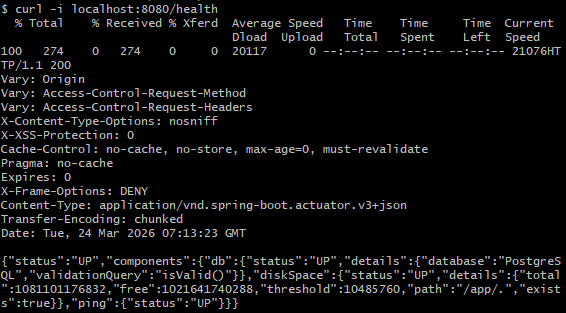
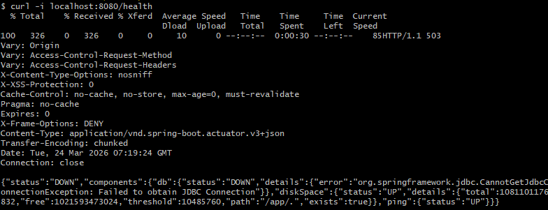
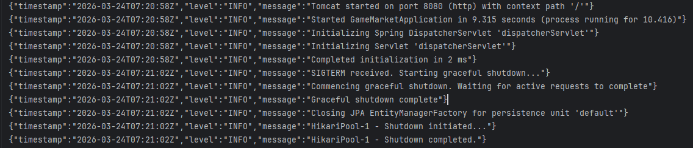

# Лабораторна робота №0: Підготовка застосунку — Readiness & Standardization

## Запуск застосунку

### Через Docker Compose

```bash
# Створити .env зі змінними оточеннями
 
# Виконати команду
docker-compose up --build
 
# Зупинити
docker-compose down
```

> Застосунок буде доступний на `http://localhost:8080`  
> Міграції застосовуються автоматично під час старту.
 
---

### Запуск тестів через Gradle

```bash
# Запустити всі юніт-тести
./gradlew test -x jacocoTestCoverageVerification
```
 
---


## 1. Налаштування (Environment Variables)

| Змінна | Опис | Приклад                   |
|--------|------|---------------------------|
| `GITHUB_CLIENT_ID` | Client ID для GitHub OAuth | `your_client_id`          |
| `GITHUB_CLIENT_SECRET` | Client Secret для GitHub OAuth | `your_secret`             |
| `DB_HOST` | Хост бази даних | `db`                      |
| `DB_NAME` | Назва бази даних | `mydatabase`              |
| `DB_USER` | Користувач БД | `user`                    |
| `DB_PASSWORD` | Пароль до БД | `password`                |
| `DB_PORT` | Порт бази даних | `5432`                    |
| `APP_URL` | URL застосунку | `http://localhost:8080`   |
| `KEY_SERVICE_URL` | URL сервісу ключів | `http://localhost:8081`   |
| `GITHUB_URL` | URL GitHub | `https://github.com/`     |
| `GITHUB_API_URL` | URL GitHub API | `https://api.github.com/` |

---

## 2. Health Check

### ✅ БД підключена `200 OK`



---

### ❌ БД зупинена `503 Service Unavailable`


---

## 3. Приклад JSON-логів

> Логи під час запуску сервера:

```json
{"timestamp":"2026-03-24T07:18:09Z","level":"INFO","message":"Initialized JPA EntityManagerFactory for persistence unit 'default'"}
{"timestamp":"2026-03-24T07:18:09Z","level":"INFO","message":"Hibernate is in classpath; If applicable, HQL parser will be used."}
{"timestamp":"2026-03-24T07:18:11Z","level":"INFO","message":"Exposing 1 endpoint beneath base path ''"}
{"timestamp":"2026-03-24T07:18:12Z","level":"INFO","message":"Starting ProtocolHandler [\"http-nio-8080\"]"}
{"timestamp":"2026-03-24T07:18:12Z","level":"INFO","message":"Tomcat started on port 8080 (http) with context path '/'"}
{"timestamp":"2026-03-24T07:18:12Z","level":"INFO","message":"Started GameMarketApplication in 11.405 seconds (process running for 12.234)"}
```
---

## 4. Graceful Shutdown


Після отримання сигналу сервер:
1. Лог: `"SIGTERM received. Starting graceful shutdown..."`
2. Завершення обробки поточних HTTP-запитів.
3. Закриття всіх з'єднань з базою даних.


